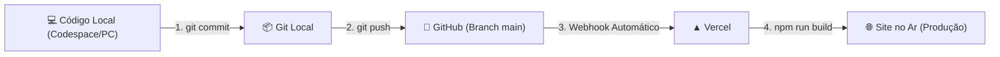

# 🚀 Guia de Commit e Deploy Contínuo na Vercel

Este guia detalha o passo a passo completo para salvar suas alterações com o **Git**, enviá-las ao repositório no **GitHub** (`git push`) e disparar o **Deploy Automático na Vercel**.

---

## 🔄 Como funciona a integração Git + GitHub + Vercel?

Quando seu repositório está conectado à Vercel:



1. Você desenvolve e testa as alterações localmente.
2. Cria um **`commit`** (ponto de salvamento com mensagem descritiva).
3. Envia os commits para o GitHub com **`git push`**.
4. A **Vercel** detecta o novo push automaticamente, executa o `npm run build` e atualiza a sua Landing Page em produção em poucos segundos.

---

## 📋 Passo a Passo: Do Código ao Deploy

### Passo 0: Pré-validação (Recomendado)

Antes de enviar qualquer código para a Vercel, sempre teste se o build de produção está passando sem erros de compilação:

```bash
npm run build
```

> Se o build terminar com `✓ built in ...ms`, seu projeto está 100% pronto para o deploy sem risco de quebrar no servidor da Vercel.

---

### Passo 1: Verificar o que foi alterado

Veja quais arquivos foram criados, modificados ou excluídos:

```bash
git status
```

---

### Passo 2: Adicionar os arquivos para o commit (`staging`)

Para adicionar todas as alterações (novos componentes, imagens, estilos e documentos):

```bash
git add .
```

> **Dica:** Se quiser adicionar apenas arquivos específicos:
>
> ```bash
> git add src/components/contato/ src/assets/qr-code.jpg
> ```

---

### Passo 3: Criar o Commit com mensagem descritiva

O commit registra o que foi feito. Siga boas práticas de mensagens:

```bash
git commit -m "feat: adiciona qr code do whatsapp, politicas de uso e ajusta botao flutuante"
```

#### 💡 Sugestões de prefixos úteis (Conventional Commits):

- `feat:` Quando adicionar uma nova funcionalidade (ex.: novo componente, QR Code, modal).
- `fix:` Quando corrigir algum bug ou defeito (ex.: correção de posição do botão flutuante).
- `style:` Quando alterar apenas cores, fontes, espaçamentos ou CSS sem alterar lógica.
- `docs:` Quando atualizar documentações (ex.: `commit.md`, `icones.md`, `README.md`).
- `refactor:` Quando reorganizar código ou modularizar dados sem alterar o comportamento visual.

---

### Passo 4: Enviar para o GitHub e disparar a Vercel (`git push`)

Envie os commits da branch local para o repositório remoto:

```bash
git push origin main
```

_(Caso a sua branch principal se chame `master`, utilize `git push origin master`)_.

---

### Passo 5: Acompanhar o Deploy na Vercel

Assim que o comando `git push` for concluído:

1. Acesse o painel da **[Vercel Dashboard](https://vercel.com/dashboard)**.
2. Abra o projeto da **Landing Page JM Piscinas**.
3. Na aba **Deployments**, você verá uma nova versão com status **`Building`** (Construindo) e, em seguida, **`Ready`** (Pronto).
4. O link de produção da sua Landing Page já estará com todas as novidades no ar!

---

## ⚡ Atalho Rápido (Comando Único)

Para o dia a dia, quando já tiver testado com `npm run build`, você pode rodar os 3 comandos em uma única linha:

```bash
git add . && git commit -m "feat: atualizacoes na landing page jm piscinas" && git push origin main
```

---

## 🛠️ Resolução de Dúvidas e Problemas Frequentes

### 1. O que fazer se o build na Vercel falhar (`Error: Command "npm run build" exited with 1`)?

- Verifique se esqueceu de importar algum arquivo ou digitou o caminho em maiúsculas/minúsculas incorreto (o Linux diferencia maiúsculas de minúsculas, por exemplo `Logo.jpeg` vs `logo.jpeg`).
- Teste sempre localmente rodando `npm run build` no terminal para identificar o arquivo com erro antes de subir.

### 2. A Vercel não atualizou após o push?

- Verifique se você está conectado na branch configurada na Vercel (geralmente `main`).
- Confira se o push realmente foi enviado executando `git status` (deve exibir _"Your branch is up to date with 'origin/main'"_).

### 3. Como descartar alterações que não deram certo antes de commitar?

- Para descartar alterações de um arquivo específico:
  ```bash
  git restore caminho/do/arquivo.jsx
  ```
- Para limpar arquivos não rastreados que você criou por engano:
  ```bash
  git clean -fd
  ```
