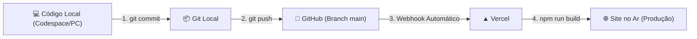
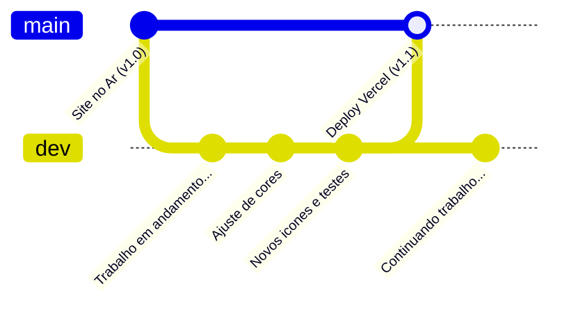

# 🚀 Guia de Commit e Deploy Contínuo na Vercel

Este guia detalha o passo a passo completo para salvar suas alterações com o **Git**, enviá-las ao repositório no **GitHub** (`git push`) e disparar o **Deploy Automático na Vercel**.

---

## 🔄 Como funciona a integração Git + GitHub + Vercel?

Quando seu repositório está conectado à Vercel:



1. Você desenvolve e testa as alterações localmente.
2. Cria um **`commit`** (ponto de salvamento com mensagem descritiva).
3. Envia os commits para o GitHub com **`git push`**.
4. A **Vercel** detecta o novo push automaticamente, executa o `npm run build` e atualiza a sua Landing Page em produção em poucos segundos.

---

## 📋 Passo a Passo: Do Código ao Deploy

### Passo 0: Pré-validação (Recomendado)

Antes de enviar qualquer código para a Vercel, sempre teste se o build de produção está passando sem erros de compilação:

```bash
npm run build
```

> Se o build terminar com `✓ built in ...ms`, seu projeto está 100% pronto para o deploy sem risco de quebrar no servidor da Vercel.

---

### Passo 1: Verificar o que foi alterado

Veja quais arquivos foram criados, modificados ou excluídos:

```bash
git status
```

---

### Passo 2: Adicionar os arquivos para o commit (`staging`)

Para adicionar todas as alterações (novos componentes, imagens, estilos e documentos):

```bash
git add .
```

> **Dica:** Se quiser adicionar apenas arquivos específicos:
>
> ```bash
> git add src/components/contato/ src/assets/qr-code.jpg
> ```

---

### Passo 3: Criar o Commit com mensagem descritiva

O commit registra o que foi feito. Siga boas práticas de mensagens:

```bash
git commit -m "feat: adiciona qr code do whatsapp, politicas de uso e ajusta botao flutuante"
```

#### 💡 Sugestões de prefixos úteis (Conventional Commits):

- `feat:` Quando adicionar uma nova funcionalidade (ex.: novo componente, QR Code, modal).
- `fix:` Quando corrigir algum bug ou defeito (ex.: correção de posição do botão flutuante).
- `style:` Quando alterar apenas cores, fontes, espaçamentos ou CSS sem alterar lógica.
- `docs:` Quando atualizar documentações (ex.: `commit.md`, `icones.md`, `README.md`).
- `refactor:` Quando reorganizar código ou modularizar dados sem alterar o comportamento visual.

---

### Passo 4: Enviar para o GitHub e disparar a Vercel (`git push`)

Envie os commits da branch local para o repositório remoto:

```bash
git push origin main
```

_(Caso a sua branch principal se chame `master`, utilize `git push origin master`)_.

---

### Passo 5: Acompanhar o Deploy na Vercel

Assim que o comando `git push` for concluído:

1. Acesse o painel da **[Vercel Dashboard](https://vercel.com/dashboard)**.
2. Abra o projeto da **Landing Page JM Piscinas**.
3. Na aba **Deployments**, você verá uma nova versão com status **`Building`** (Construindo) e, em seguida, **`Ready`** (Pronto).
4. O link de produção da sua Landing Page já estará com todas as novidades no ar!

---

## ⚡ Atalho Rápido (Comando Único)

Para o dia a dia, quando já tiver testado com `npm run build`, você pode rodar os 3 comandos em uma única linha:

```bash
git add . && git commit -m "feat: atualizacoes na landing page jm piscinas" && git push origin main
```

---

## 🛠️ Resolução de Dúvidas e Problemas Frequentes

### 1. O que fazer se o build na Vercel falhar (`Error: Command "npm run build" exited with 1`)?

- Verifique se esqueceu de importar algum arquivo ou digitou o caminho em maiúsculas/minúsculas incorreto (o Linux diferencia maiúsculas de minúsculas, por exemplo `Logo.jpeg` vs `logo.jpeg`).
- Teste sempre localmente rodando `npm run build` no terminal para identificar o arquivo com erro antes de subir.

### 2. A Vercel não atualizou após o push?

- Verifique se você está conectado na branch configurada na Vercel (geralmente `main`).
- Confira se o push realmente foi enviado executando `git status` (deve exibir _"Your branch is up to date with 'origin/main'"_).

### 3. Como descartar alterações que não deram certo antes de commitar?

- Para descartar alterações de um arquivo específico:
  ```bash
  git restore caminho/do/arquivo.jsx
  ```
- Para limpar arquivos não rastreados que você criou por engano:
  ```bash
  git clean -fd
  ```

---

## 🌿 Fluxo com Branches: Desenvolver na `dev` e subir para a Vercel apenas pela `main`

Trabalhar diretamente na `main` pode ser arriscado se você fizer um commit incompleto que vá direto para o ar na Vercel. A melhor prática do mercado é ter uma **branch de desenvolvimento** (chamada `dev` ou `develop`).



### 1️⃣ Criar a branch `dev` (Fazer uma única vez)

Para criar e já entrar na branch `dev`:

```bash
git checkout -b dev
```

> **Para verificar em qual branch você está:**
>
> ```bash
> git branch
> ```
>
> A branch ativa terá um asterisco verde na frente: `* dev`.

---

### 2️⃣ Seu Dia a Dia de Trabalho (Sempre na branch `dev`)

Faça suas alterações no código, teste à vontade e faça commits normalmente:

```bash
# 1. Verifica os arquivos
git status

# 2. Adiciona as alterações
git add .

# 3. Faz o commit
git commit -m "feat: ajustando detalhes no componente carrossel"

# 4. (Opcional) Salva a branch dev no GitHub para backup na nuvem
git push origin dev
```

> 🛡️ **Segurança Total:** O seu site oficial de produção na Vercel **NÃO** será alterado por esse push! Ele continuará exibindo com segurança a versão estável da branch `main`.

---

### 3️⃣ Quando tudo estiver pronto para ir para o ar (Deploy na Vercel)

Quando você terminar suas alterações na `dev` e validar com `npm run build`, siga este ciclo de 4 passos para publicar:

```bash
# Passo A: Vá para a branch principal (main)
git checkout main

# Passo B: Garanta que sua main local está sincronizada com o GitHub
git pull origin main

# Passo C: Faça o merge com --no-ff (cria um commit exclusivo de produção para a Vercel)
git merge dev --no-ff -m "merge: publica melhorias da branch dev na producao"

# Passo D: Envie para o GitHub para acionar a Vercel!
git push origin main
```

> ⚠️ **Por que usar `--no-ff`?**
> Se você der push na branch `dev` primeiro, a Vercel cria uma versão de _Preview_ para aquele commit.
> Se você juntar na `main` sem o `--no-ff` (modo padrão fast-forward), o Git reutiliza o mesmo código de commit. A Vercel então acha que o commit já foi processado e não re-publica em produção.
> Usando `git merge dev --no-ff`, o Git cria um **novo commit oficial de produção**, forçando a Vercel a atualizar o link principal imediatamente!

---

### 🚀 Alternativa Direta: "Promote to Production" no Painel da Vercel

Se você já enviou a branch `dev` para o GitHub e a Vercel gerou um Preview com sucesso:

1. Abra a [Vercel Dashboard](https://vercel.com/dashboard).
2. Acesse seu projeto e vá na aba **Deployments**.
3. No deployment da branch `dev`, clique nos **três pontinhos (`...`)**.
4. Clique em **"Promote to Production"**.
5. Em 2 segundos, aquele deploy vira o site oficial de produção!

---

### 4️⃣ Voltar para a `dev` para continuar programando

Assim que terminar o push na `main`, volte imediatamente para a sua branch de trabalho:

```bash
git checkout dev
```

Agora você pode continuar programando novas funcionalidades sem medo de afetar o site no ar.

---

### ⚙️ Dica Bônus Vercel: Evitar deploys de preview da branch `dev`

Por padrão, a Vercel pode gerar links de _"Preview"_ para a branch `dev`. Se você quiser que a Vercel ignore 100% qualquer push da `dev` e **apenas construa a `main`**:

1. Acesse seu projeto na **Vercel** $\rightarrow$ **Settings** $\rightarrow$ **Git**.
2. No campo **Production Branch**, certifique-se de que está selecionado `main`.
3. Na seção **Ignored Build Step**, você pode marcar para ignorar branches que não sejam a de produção, ou simplesmente ignorar as URLs de preview.
